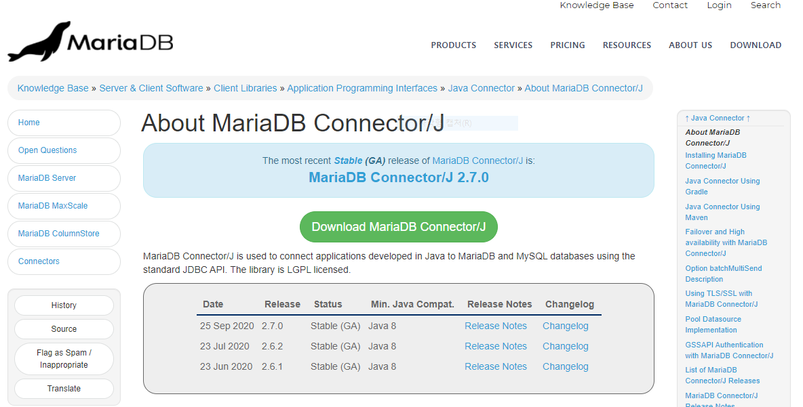
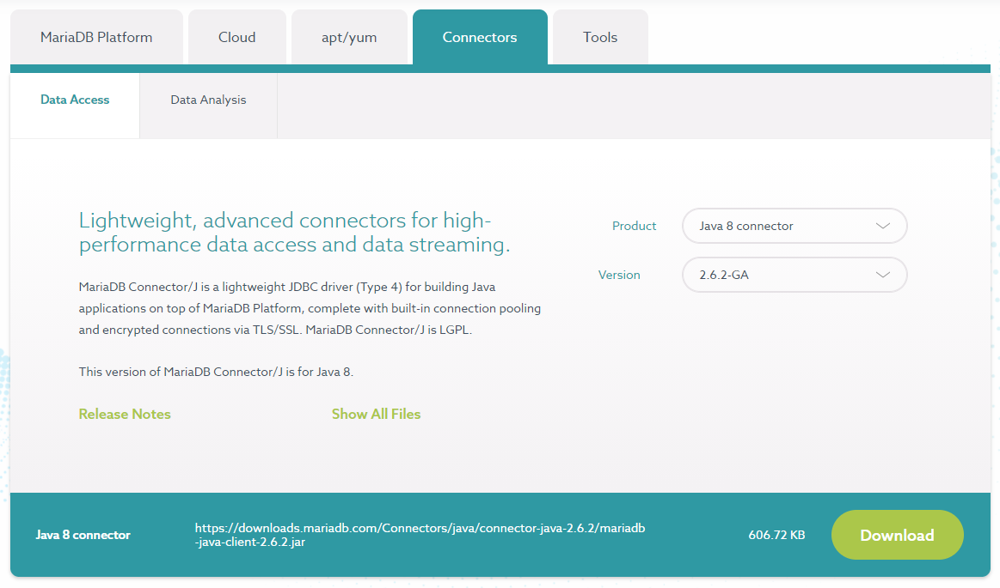
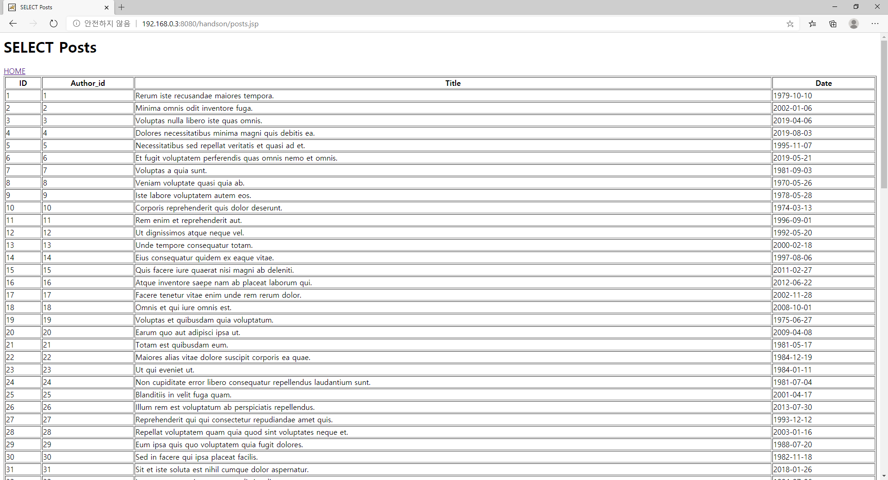
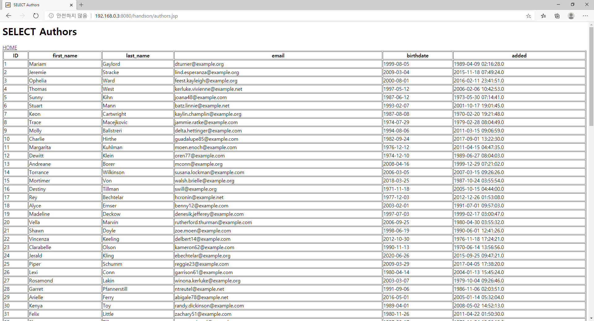
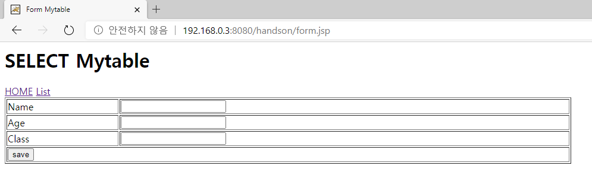
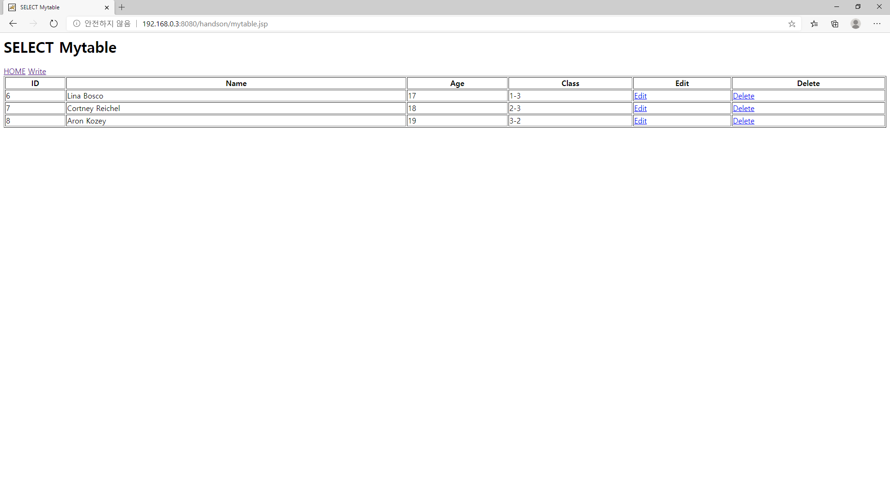
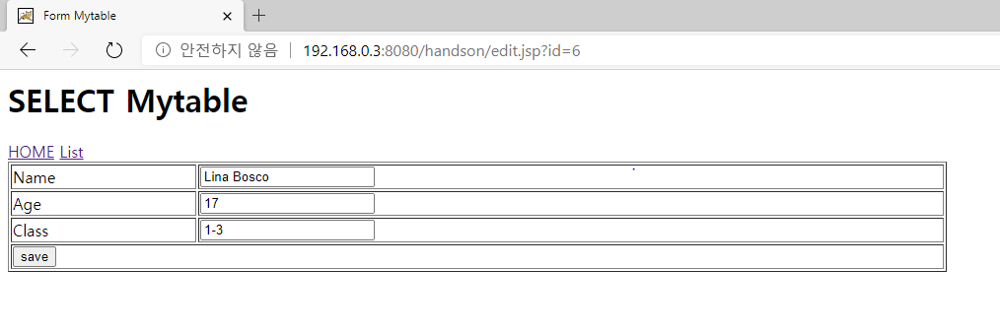

# Application 만들기

> 1. Apache Tomcat 에서 어플리케이션을 테스트하기 위해서 JSP 를 이용한 페이지를 만든다.
> 2. mairadb 를 연결하기 위해 jdbc 드라이브를 다운로드 받고 설치합니다.
> 3. mariadb 에 생성된 authors 테이블과 posts 테이블의 데이터 목록을 확인하는 어플리케이션을 만든다.

## mariadb jdbc 다운로드
https://mariadb.com/kb/en/about-mariadb-connector-j/

Java8 Connector 을 선택하고 다운로드 한다.


다운로드 받은 jdbc는 /root/apache-tomcat-9.0.38/lib 에 복사한다.
```
# cp mariadb-java-client-2.6.2.jar /root/apache-tomcat-9.0.38/lib

#  ls  /root/apache-tomcat-9.0.38/lib/mariadb-java-client-2.6.2.jar 
/root/apache-tomcat-9.0.38/lib/mariadb-java-client-2.6.2.jar
```

Apache Tomcat 을 재기동 한다.
```
# cd /root/apache-tomcat-9.0.38/bin
#  ./shutdown.sh 
Using CATALINA_BASE:   /root/apache-tomcat-9.0.38
Using CATALINA_HOME:   /root/apache-tomcat-9.0.38
Using CATALINA_TMPDIR: /root/apache-tomcat-9.0.38/temp
Using JRE_HOME:        /usr
Using CLASSPATH:       /root/apache-tomcat-9.0.38/bin/bootstrap.jar:/root/apache-tomcat-9.0.38/bin/tomcat-juli.jar
Using CATALINA_OPTS:   

# ./startup.sh
Using CATALINA_BASE:   /root/apache-tomcat-9.0.38
Using CATALINA_HOME:   /root/apache-tomcat-9.0.38
Using CATALINA_TMPDIR: /root/apache-tomcat-9.0.38/temp
Using JRE_HOME:        /usr
Using CLASSPATH:       /root/apache-tomcat-9.0.38/bin/bootstrap.jar:/root/apache-tomcat-9.0.38/bin/tomcat-juli.jar
Using CATALINA_OPTS:   
Tomcat started.
```

## 어플리케이션 만들기
Apache Tomcat 의 어플리케이션 디렉토리는 webapps 에 생성된다.
기본 어플리케이션은 ROOT,doc,examples 등이 존재한다. 기본 제공하는 어플리케이션을 모두 삭제하고 handson 어플리케이션을 생성한다.
```
# ls /root/apache-tomcat-9.0.38/webapps/
docs  examples host-manager  manager  ROOT

# rm -rf /root/apache-tomcat-9.0.38/webapps/*

# mkdir /root/apache-tomcat-9.0.38/webapps/handson
```
> 샘플어플리케이션은 https://github.com/nationminu/hands-on 에서 다운로드 가능하다.

## posts.jsp
mariadb 에 있는 posts 테이블의 데이터 목록을 출력하는 어플리케이션.

```
<%@ page language="java" contentType="text/html; charset=UTF-8"
pageEncoding="UTF-8"%>
<%@ page import = "java.io.*,java.util.*,java.sql.*"%>  
<html>
   <head>
      <title>SELECT Posts</title>
   </head>

   <body> 
	  <H1>SELECT Posts</H1>
	  <a href="./index.jsp">HOME</a>
      <table border = "1" width = "100%">
         <tr>
            <th>ID</th>
            <th>Author_id</th>
            <th>Title</th>
            <th>Date</th>
         </tr>
         <%
		 
		Connection con = null;
		PreparedStatement pstmt = null;   
		ResultSet rs = null;

		 try {
			Class.forName("org.mariadb.jdbc.Driver");
            
            con = DriverManager.getConnection(
                "jdbc:mariadb://127.0.0.1:3306/handson",
                "handson",
                "1234");
                        
            pstmt = con.prepareStatement("select * from posts");
            
            rs = pstmt.executeQuery();

			while(rs.next()) {
            %>

            <tr>
               <td><%=rs.getString("id")%></td>
               <td><%=rs.getString("author_id")%></td>
               <td><%=rs.getString("title")%></td>
               <td><%=rs.getString("date")%></td>
            </tr> 
			<%
				 }
			} catch(Exception e) {
				e.printStackTrace();
			} finally {
				try {
					if(rs != null) {
						rs.close(); 
					}
					
					if(pstmt != null) {
						pstmt.close(); 
					}
				
					if(con != null) {
						con.close(); 
					}
				} catch (SQLException e) {
					e.printStackTrace();
				}
			}
			%>

      </table>
 
   </body>
</html>
```
 
## authors.jsp
mariadb 에 있는 authors 테이블의 데이터 목록을 출력하는 어플리케이션.

```
<%@ page language="java" contentType="text/html; charset=UTF-8"
pageEncoding="UTF-8"%>
<%@ page import = "java.io.*,java.util.*,java.sql.*"%>  
<html>
   <head>
      <title>SELECT Authors</title>
   </head>

   <body> 
	  <H1>SELECT Authors</H1> 
	  <a href="./index.jsp">HOME</a>
      <table border = "1" width = "100%">
         <tr>
            <th>ID</th>
            <th>first_name</th>
            <th>last_name</th>
            <th>email</th>
            <th>birthdate</th>
            <th>added</th>
         </tr>
         <%
		 
		Connection con = null;
		PreparedStatement pstmt = null;   
		ResultSet rs = null;

		 try {
			Class.forName("org.mariadb.jdbc.Driver");
            
            con = DriverManager.getConnection(
                "jdbc:mariadb://127.0.0.1:3306/handson",
                "handson",
                "1234");
                        
            pstmt = con.prepareStatement("select * from authors");
            
            rs = pstmt.executeQuery();

			while(rs.next()) {
            %>

            <tr>
               <td><%=rs.getString("id")%></td>
               <td><%=rs.getString("first_name")%></td>
               <td><%=rs.getString("last_name")%></td>
               <td><%=rs.getString("email")%></td>
               <td><%=rs.getString("birthdate")%></td>
               <td><%=rs.getString("added")%></td>
            </tr> 
			<%
				 }
			} catch(Exception e) {
				e.printStackTrace();
			} finally {
				try {
					if(rs != null) {
						rs.close(); 
					}
					
					if(pstmt != null) {
						pstmt.close();  
					}
				
					if(con != null) {
						con.close();  
					}
				} catch (SQLException e) {
					e.printStackTrace();
				}
			}
			%>

      </table>
 
   </body>
</html> 
``` 
--- 

## CURD SAMPLE Application

> * mariadb 에 직접 만든 테이블 mytable 에서 CRUD 를 구현하는 어플리케이션을 만들어 보자. 
> * CRUD 는 CREATE, READ, UPDATE, DELETE 를 의미한다.

1. CREATE : form.jsp, save.jsp

mariadb 에 있는 mytable 테이블의 데이터 저장하는 어플리케이션.



* form.jsp

```
<html>
   <head>
      <title>Form Mytable</title>
   </head>
   
   <body> 
	  <H1>SELECT Mytable</H1> 
	  <a href="./index.jsp">HOME</a> <a href="./mytable.jsp">List</a>
	  <form action="save.jsp" method="POST">
      <table border = "1" width="50%">
         <tr>
            <td width="20%">Name</td>
            <td><input type="text" name="name" value=""></td> 
         </tr>
         <tr>
            <td width="20%">Age</td>
            <td><input type="number" name="age" value=""></td> 
         </tr>
         <tr>
            <td width="20%">Class</td>
            <td><input type="text" name="class" value="" maxlength="5"></td> 
         </tr>
         <tr>
            <td colspan=2><input type="submit" value="save"></td> 
         </tr> 
		</table>
		</form>
	</body>
</html>
```

* save.jsp

```
<%@ page language="java" contentType="text/html; charset=UTF-8"
pageEncoding="UTF-8"%>
<%@page import="java.sql.*,java.util.*"%>

<%
String name=request.getParameter("name");
String age=request.getParameter("age");
String cls=request.getParameter("class"); 

Connection con = null; 
Statement st   = null;

try
{

	Class.forName("org.mariadb.jdbc.Driver");
	
	con = DriverManager.getConnection(
		"jdbc:mariadb://127.0.0.1:3306/handson",
		"handson",
		"1234"); 

	st=con.createStatement();

	int i=st.executeUpdate("insert into mytable(name,age,class) values('"+name+"','"+age+"','"+cls+"')");
	
	out.println("Data is successfully inserted!");
	
}	
	catch(Exception e)
{
	out.print(e);
	System.out.print(e);
	e.printStackTrace();
}
%>
<div><a href="./index.jsp">home</a></div>
<div><a href="./authors.jsp">authors</a></div>
<div><a href="./posts.jsp">posts</a></div>
<div><a href="./mytable.jsp">mytable</a></div>
<script>
window.location.href = "./mytable.jsp";
</script>
```

2. READ : mytable.jsp

mariadb 에 있는 mytable 테이블의 데이터 목록을 출력하는 어플리케이션.



```
<%@ page language="java" contentType="text/html; charset=UTF-8"
pageEncoding="UTF-8"%>
<%@ page import = "java.io.*,java.util.*,java.sql.*"%>  
<html>
   <head>
      <title>SELECT Mytable</title>
   </head>

   <body> 
	  <H1>SELECT Mytable</H1> 
	  <a href="./index.jsp">HOME</a> <a href="./form.jsp">Write</a>
      <table border = "1" width = "100%">
         <tr>
            <th>ID</th>
            <th>Name</th>
            <th>Age</th>
            <th>Class</th> 
            <th>Edit</th> 
            <th>Delete</th> 
         </tr>
         <%
		 
		 Connection con = null;
		 PreparedStatement pstmt = null;   
		 ResultSet rs = null;

		 try {
			Class.forName("org.mariadb.jdbc.Driver");
            
            con = DriverManager.getConnection(
                "jdbc:mariadb://127.0.0.1:3306/handson",
                "handson",
                "1234");
                        
            pstmt = con.prepareStatement("select * from mytable");
            
            rs = pstmt.executeQuery();

			while(rs.next()) {
            %>

            <tr>
               <td><%=rs.getString("id")%></td>
               <td><%=rs.getString("name")%></td>
               <td><%=rs.getString("age")%></td>
               <td><%=rs.getString("class")%></td> 
               <td><a href="edit.jsp?id=<%=rs.getString("id")%>">Edit</a></td> 
               <td><a href="delete.jsp?id=<%=rs.getString("id")%>">Delete</a></td> 
            </tr> 
			<%
				 }
			} catch(Exception e) {
				e.printStackTrace();
			} finally {
				try {
					if(rs != null) {
						rs.close(); 
					}
					
					if(pstmt != null) {
						pstmt.close();
					}
				
					if(con != null) {
						con.close(); 
					}
				} catch (SQLException e) {
					e.printStackTrace();
				}
			}
			%>

      </table>
 
   </body>
</html>
```
 
3. UPDATE : edit.jsp, update.jsp

mariadb 에 있는 데이터를 수정 어플리케이션.


* edit.jsp

```
<%@ page language="java" contentType="text/html; charset=UTF-8"
pageEncoding="UTF-8"%>
<%@page import="java.sql.*,java.util.*"%>
<html>
   <head>
      <title>Form Mytable</title>
   </head>
    <body> 
	  <H1>SELECT Mytable</H1> 
<%
String id=request.getParameter("id");  

Connection con = null; 
Statement st   = null;
ResultSet rs = null;

try
{

	Class.forName("org.mariadb.jdbc.Driver");
	
	con = DriverManager.getConnection(
		"jdbc:mariadb://127.0.0.1:3306/handson",
		"handson",
		"1234"); 

	st=con.createStatement();
 
	String sql ="select * from mytable where id="+id;
	rs = st.executeQuery(sql);
	while(rs.next()){
%>

  <a href="./index.jsp">HOME</a> <a href="./mytable.jsp">List</a>
  <form action="update.jsp" method="POST">
  <input type="hidden" name="id" value="<%=rs.getString("id") %>">
  <table border = "1" width="50%">
	 <tr>
		<td width="20%">Name</td>
		<td><input type="text" name="name" value="<%=rs.getString("name") %>"></td> 
	 </tr>
	 <tr>
		<td width="20%">Age</td>
		<td><input type="number" name="age" value="<%=rs.getString("age") %>"></td> 
	 </tr>
	 <tr>
		<td width="20%">Class</td>
		<td><input type="text" name="class" value="<%=rs.getString("class") %>" maxlength="5"></td> 
	 </tr>
	 <tr>
		<td colspan=2><input type="submit" value="save"></td> 
	 </tr> 
	</table>
	</form>

<%
	}
}	
	catch(Exception e)
{
	out.print(e);
	System.out.print(e);
	e.printStackTrace();
}
%>
	</body>
</html>
```

* update.jsp

``` 
<%@ page language="java" contentType="text/html; charset=UTF-8"
pageEncoding="UTF-8"%>
<%@page import="java.sql.*,java.util.*"%>

<%
String id=request.getParameter("id");
String name=request.getParameter("name");
String age=request.getParameter("age");
String cls=request.getParameter("class"); 

Connection con = null; 
Statement st   = null;

try
{

	Class.forName("org.mariadb.jdbc.Driver");
	
	con = DriverManager.getConnection(
		"jdbc:mariadb://127.0.0.1:3306/handson",
		"handson",
		"1234"); 

	st=con.createStatement();

	int i=st.executeUpdate("update mytable set name ='"+name+"', age='"+age+"', class='"+cls+"' where id='" + id + "'");
	
	out.println("Data is successfully updated!");
	
}	
	catch(Exception e)
{
	out.print(e);
	System.out.print(e);
	e.printStackTrace();
}
%>
<div><a href="./index.jsp">home</a></div>
<div><a href="./authors.jsp">authors</a></div>
<div><a href="./posts.jsp">posts</a></div>
<div><a href="./mytable.jsp">mytable</a></div>
<script>
window.location.href = "./mytable.jsp";
</script>
```


4. DELETE : delete.jsp
mariadb 에 있는 데이터를 삭제하는 어플리케이션. 


```
<%@ page language="java" contentType="text/html; charset=UTF-8"
pageEncoding="UTF-8"%>
<%@page import="java.sql.*,java.util.*"%>
<%
String id=request.getParameter("id"); 

Connection con = null; 
Statement st   = null;

try
{
	Class.forName("org.mariadb.jdbc.Driver");
	
	con = DriverManager.getConnection(
		"jdbc:mariadb://127.0.0.1:3306/handson",
		"handson",
		"1234"); 

	st=con.createStatement();

	int i=st.executeUpdate("delete from mytable where id='" + id + "'");
	
	out.println("Data is successfully deleted!");
	
}	
	catch(Exception e)
{
	out.print(e);
	System.out.print(e);
	e.printStackTrace();
}
%>
<div><a href="./index.jsp">home</a></div>
<div><a href="./authors.jsp">authors</a></div>
<div><a href="./posts.jsp">posts</a></div>
<div><a href="./mytable.jsp">mytable</a></div>
<script>
window.location.href = "./mytable.jsp";
</script>
```

## GIT 을 사용하여 완성된 어플리케이션을 확인할수 있다.
Git(https://git-scm.com/book/ko/v2) 은 소프트웨어를 개발하는 기업의 핵심 자산인 소스코드를 효과적으로 관리할 수 있게 해주는 무료, 공개소프트웨어.

```
# git clone https://github.com/nationminu/hands-on
# cp hands-on/app/apache-tomcat-9.0.38.tar.gz .
# tar -zxvf apache-tomcat-9.0.38.tar.gz
# cd apache-tomcat-9.0.38/bin
# ./startup.sh
```


