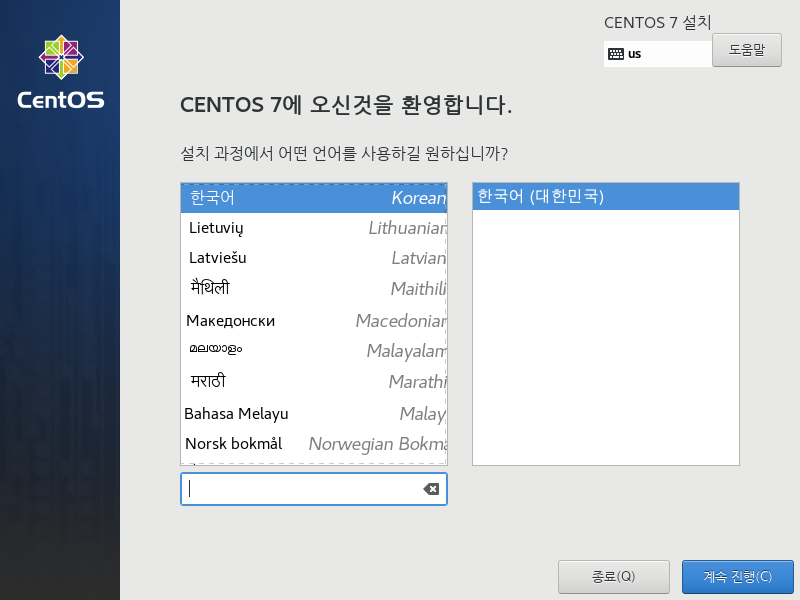

# Centos 리눅스 설치 Hands On 

## Centos 패키지 다운로드 

https://www.centos.org/ -> Download -> 7(2003) -> x86_64 -> mirror 다운로드 

## kakao mirror direct iso
http://mirror.kakao.com/centos/7.8.2003/isos/x86_64/CentOS-7-x86_64-DVD-2003.iso

1. centos 홈페이지 접속

2. Download 클릭후 패키지 선택

3. 미러를 통해 패키지 다운로드


---
## VMware 설정

---
## Virtualbox 설정
* Virtualbox 기동후 New 클릭으로 새로운 VM 생성

* 필수정보 입력후 다음 - 이름(Name) : <아이디>01 , Type : Linux , Version : Red Hat (64-bit)

* 메모리를 4096MB(4G) 로 설정합니다.

* Hard disk 를 만들 방법을 정의합니다.

* Hard disk 타입을 정의합니다. 본 Labs 에서는 VDI 로 생성합니다.

* Hard disk 생성 방법을 선택합니다. dymamically allocation : 사용하면서 지속적으로 증가, Fixed size : 생성시 설정사이즈를 전부 할당

* Hard disk 생성 위치와 크기를 설정합니다.

* 최종 생성된 VM 을 확인하고 시작을 클릭하면 VM이 생성 됩니다. 최초 VM 생성시 다운로드받은 이미지를 선택하면 리눅스 설치화면을 확인할 수 있습니다.


---
## Centos 설치

1. 이미지를 넣고 부팅하고 설치 화면에서 "Install Centos 7"을 선택


2. 언어선택에서 사용하고자 하는 언어 선택(한국어)



3. 설치 요약 화면


4. 설치 대상 선택 후 완료 클릭시 파티션 자동 설정


* 필요시 파티션을 수동으로 설정 가능(Optional)

/boot, /home, swap, root 등 파티션을 수동으로 설정후 완료 클릭합니다.

 


5. 설치할 소프트웨어를 선택


* 용도에 맞는 설치 소프트웨어를 선택하여 설치합니다.
기본 최소 설치 진행합니다. (최소설치, 계산노드, 인프라서버, 파일 및 프린트 서버, 기본 웹 서버, 가항화 호스트, 서버 - GUI 사용, GNOME 데스크탑, KDE Plasma Workspaces, 개발 및 장조를 위한 워크스테이션)


6. 사용자 설정

초기 root 비밀번호 설정과 관리자 계정을 설정합니다.


 


7. 완료 단계

설치완료 후 재기동하면 로그인 화면이 나타납니다. root 또는 추가한 계정으로 로그인합니다.


 


---

## 리눅스 명령어

## 온라인 테스트 환경
https://www.katacoda.com/courses/ubuntu/playground

### whoami
현재 접속한 유저의 정보를 출력하는 명령어
```
$ whoami
root
```

### pwd(print working directory)
현재 위치중인 디렉토리 출력하는 명령어
```
$ pwd
/root
```

### mkdir (make directory)
디렉토리를 생성하는 명령어, -p 옵션을 주면 하위 디렉토리까지 생성한다. 절대 경로와 상대 경로의 사용 가능이 가능하다.
```
$ mkdir /root/mydir
$ ls
mydir

$ mkdir /root/testdir/test1
mkdir: cannot create directory ‘/root/testdir/test1’: No such file or directory

$ mkdir -p /root/testdir/test1
$ ls /root/testdir
test1

$ mkdir ./testdir/test{2..10}
$ ls 
mydir  test1  test10  test2  test3  test4  test5  test6  test7  test8  test9  testdir
```

### cd(change directory)
디렉토리 경로를 이동하는 명령어, 절대 경로와 상대 경로의 이동이 가능하다.
```
$ cd /root/testdir
$ ls 
mydir  test1  test10  test2  test3  test4  test5  test6  test7  test8  test9  testdir

$ cd ..
$ pwd
/root
```

### ls(list)
디렉토리 및 파일 목록 확인하는 명령어. -a 모든 목록 출력과 -l 리스트 출력등의 옵션이 있다.
```
$ ls
mydir  testdir

$ ls -l
total 8
drwxr-xr-x  2 root root 4096 Oct  7 08:52 mydir
drwxr-xr-x 12 root root 4096 Oct  7 08:57 testdir

ls -a
.  ..  .bashrc  .cache  .hushlogin  mydir  .profile  .ssh  testdir  .vimrc

$ ls -al
total 36
drwx------  6 root root 4096 Oct  7 09:02 .
drwxr-xr-x 25 root root 4096 Jul 16 11:39 ..
-rw-r--r--  1 root root 3122 Jul 16 11:37 .bashrc
drwx------  2 root root 4096 Oct  7 08:43 .cache
-rw-r--r--  1 root root    0 Jul 16 11:40 .hushlogin
drwxr-xr-x  2 root root 4096 Oct  7 08:52 mydir
-rw-r--r--  1 root root  148 Aug 17  2015 .profile
drwxr-xr-x  2 root root 4096 Jul 16 11:42 .ssh
drwxr-xr-x 12 root root 4096 Oct  7 08:57 testdir
-rw-r--r--  1 root root  123 Jul 16 11:42 .vimrc
```

### cp(copy)
파일 혹은 디렉토리를 복사하는데 사용하는 명령어, 디렉토리를 복사할때는 -r 옵션을 주어 사용한다.
```
$ cp mydir mydir1
cp: omitting directory 'mydir'

$ cp -r mydir mydir1
$ cp -r mydir mydir2

$ ls
mydir  mydir1  mydir2 testdir
```

### mv(move)
파일 혹은 디렉토리 이동하는데 사용하는 명령어, 이름을 변경하는 용도로 사용한다.
```
$ mv mydir mydir3

$ ls
mydir1  mydir2  mydir3  testdir
```

### touch
파일이나 디렉토리의 최근 업데이트 일자를 현재 시간으로 변경하는 명령어 , 파일이나 디렉토리가 존재하지 않으면 파일 생성한다.
```
$ touch myfile1
$ touch myfile2

$ ls
mydir1  mydir2  mydir3  myfile1  myfile2  testdir

$ ls -al myfile1
-rw-r--r-- 1 root root 0 Oct  8 08:23 myfile1

$ touch myfile1

$ ls -al myfile1
-rw-r--r-- 1 root root 0 Oct  8 08:24 myfile1
```

### rm (remove)
파일이나 디렉토리를 삭제하는데 사용하는 명령어, 디렉토리를 삭제할떄는 -r 옵션을 주고 사용한다. -f 옵션은 삭제여부를 묻지않고 삭제한다.
```
$ rm mydir3
rm: cannot remove 'mydir3': Is a directory

$ rm -rf mydir3
mydir1  mydir2  myfile1  myfile2  testdir

$ rm -f myfile2
mydir1  mydir2  myfile1  testdir
```

### echo, cat (concatenate)
"echo" : 문자열을 출력해주는 명령어, > 와 함께 사용하여 파일을 생성하거나 내용을 변경할 수 있다.

"cat" : 파일을 내용을 출력하는데 사용하는 명령어, 파일의 내용을 합치거나, 새로운 파일을 만들때도 사용한다.

"redirection" ('>', '>>') : 스트림의 방향을 조정하는 명령어, "명령 > 파일" 명령의 결과를 파일로 저장한다.
```
$ echo "hello"
hello

$ echo "hello" > hello.txt
$ cat hello.txt
hello

$ echo "world" > world.txt
$ cat world.txt
world

$ cat hello.txt world.txt
hello
world

$ cat hello.txt world.txt
hello
world

$ cat hello.txt world.txt  > helloworld.txt
$ cat helloworld.txt
hello
world

```

### head
파일의 앞부분을 출력하는 명령어 , - 옵션으로 설정된 라인만큼을 출력한다. 설정하지 않을 경우 10줄을 출력한다.
```
$ for i in {1..100}; do echo $i >> example.txt ; done

$ head example.txt

$ head example.txt
1
2
3
4
5
6
7
8
9
10

$ head  -5 example.txt
1
2
3
4
5
```

### tail
파일을 뒷부분을 출력하는 명령어, - 옵션으로 설정된 라인만큼을 출력한다. 설정하지 않을 경우 10줄을 출력한다. -f 옵션은 파일이 변경되면 실시간으로 내용을 업데이트한다.
```
$ tail example.txt
91
92
93
94
95
96
97
98
99
100

$ tail -5 example.txt
96
97
98
99
100

$ tail -f example.txt
91
92
93
94
95
96
97
98
99
100
```

### find
파일이나 디렉토리를 검색하는 명령어, 디렉토리 경로에서 파일이름 확장자와 같은 검색 조건으로 검색한다.
-exec 옵션으로 다른 명령어와 함께 사용이 가능하다.
```
$ find ./ -name "test1"
./testdir/test1

$ find ./ -name "*.txt"
./world.txt
./helloworld.txt
./hello.txt
./example.txt

$ find ./ -type d
./
./mydir2
./.ssh
./mydir1
./.cache
./testdir
./testdir/test4
./testdir/test8
./testdir/test5
./testdir/test2
./testdir/test3
./testdir/test7
./testdir/test10
./testdir/test1
./testdir/test6
./testdir/test9

$ find ./ -type f
./.ssh/config
./.ssh/id_rsa
./.ssh/authorized_keys
./myfile1
./.bashrc
./.profile
./world.txt
./.vimrc
./.cache/motd.legal-displayed
./helloworld.txt
./hello.txt
./example.txt
./.hushlogin

$ find ./ -name "*.txt" -exec rm -f {} \;
$ find ./ -name "*.txt"
```


### man(Manual pager utils)
명령어의 사용법이나 매뉴얼을 보는 명령어
```
$ man cat
NAME 
        cat - concatenate files and print on the standard output

SYNOPSIS
        cat [OPTION] ...    [FILE] ... 
```