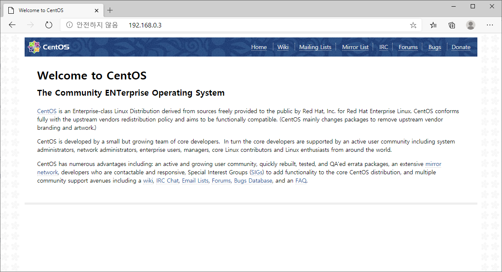
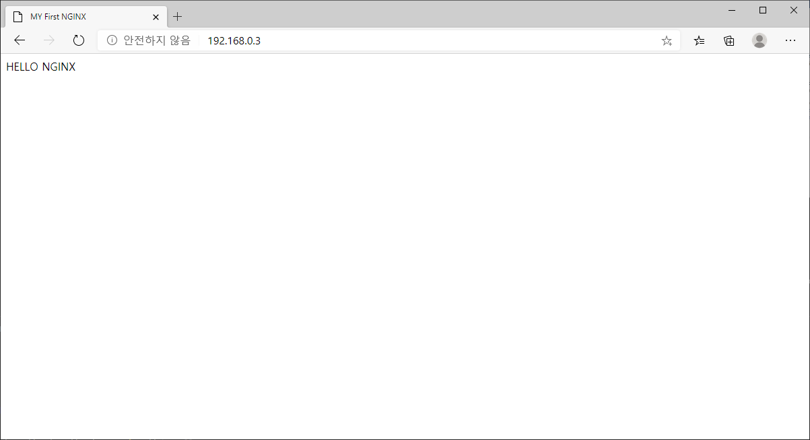

# Nginx 웹서버 설치

## Nginx 웹서버 설치 
nginx 웹서버는 centos 의 기본 패키지가 아니기 때문에 외부 저장소를 설정해서 설치합니다.
EPEL 은 Extra Packages for Enterprise Linux 의 약자로 기업용 리눅스 환경을 위한 추가 패키지이다.
```
$ sudo yum install epel-release

$ sudo systemctl start nginx

$ sudo systemctl status nginx
● nginx.service - The nginx HTTP and reverse proxy server
   Loaded: loaded (/usr/lib/systemd/system/nginx.service; disabled; vendor preset: disabled)
   Active: active (running) since Thu 2020-10-08 21:34:09 EDT; 3s ago
  Process: 2874 ExecStart=/usr/sbin/nginx (code=exited, status=0/SUCCESS)
  Process: 2869 ExecStartPre=/usr/sbin/nginx -t (code=exited, status=0/SUCCESS)
  Process: 2867 ExecStartPre=/usr/bin/rm -f /run/nginx.pid (code=exited, status=0/SUCCESS)
 Main PID: 2875 (nginx)
   CGroup: /system.slice/nginx.service
           ├─2875 nginx: master process /usr/sbin/nginx
           ├─2876 nginx: worker process
           └─2877 nginx: worker process

Oct 08 21:34:09 hands-on systemd[1]: Starting The nginx HTTP and reverse proxy server...
Oct 08 21:34:09 hands-on nginx[2869]: nginx: the configuration file /etc/nginx/nginx.conf syntax is ok
Oct 08 21:34:09 hands-on nginx[2869]: nginx: configuration file /etc/nginx/nginx.conf test is successful
Oct 08 21:34:09 hands-on systemd[1]: Started The nginx HTTP and reverse proxy server.
```

* http://<SERVER_IP> 기본 웹서버 페이지 확인


웹페이지가 확인되지 않을 경우 방화벽 종료후 다시 확인
```
$ sudo systemctl stop firewalld
```

HTML 테스트 페이지 만들기 [index.html](./index.html)
nginx 의 Document root 는 "/usr/share/nginx/html" 이다.
```
$ cd /usr/share/nginx/html

$ vi index.html
<HTML>
<HEAD>
<TITLE>MY First NGINX</TITLE>
</HEAD>
<BODY>
HELLO NGINX
</BODY>
</HEML> 
```

브라우저 접속시 변경된 내용 확인
