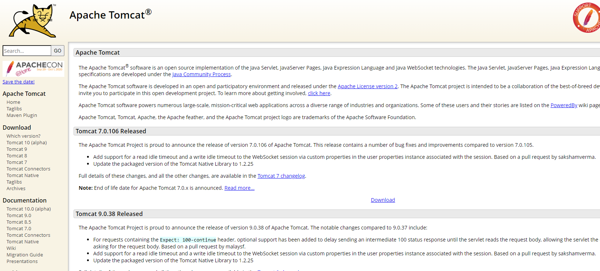
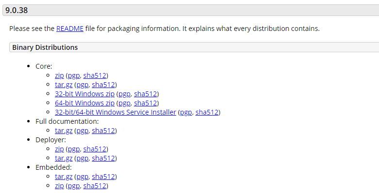
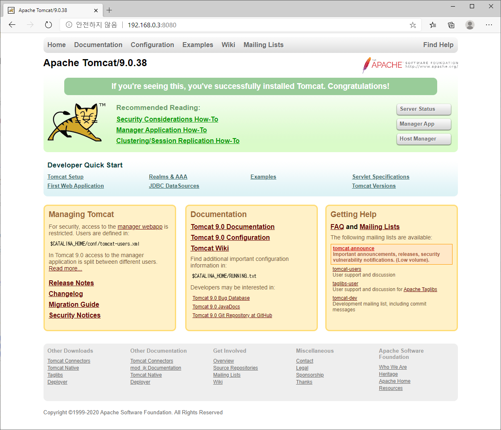

# Apache-Tomcat 설치

> Apache Tomcat 은 Java 로 만들어진 어플리케이션으로 설치전 Java 가 먼저 설치되어 있어야 한다.

## 1. java 설치
Tomcat 8 버전은 Java 8 버전이 필요하다.
```
$ sudo yum -y install java-1.8.0-openjdk java-1.8.0-openjdk-devel

$ java -version
openjdk version "1.8.0_262"
OpenJDK Runtime Environment (build 1.8.0_262-b10)
OpenJDK 64-Bit Server VM (build 25.262-b10, mixed mode)
```

## 2. Apache Tomcat 다운로드
http://tomcat.apache.org/ 접속후 Tomcat 8 다운로드



최신 버전을 다운로드 한다.


리눅스에서는 wget 명령어를 제공하여 다운로드 링크를 통한 다운로드가 가능하다.
unzip 명령어로 다운로드 받은 파일의 압축을 해제한다.
```
$ sudo yum -y install wget unzip 

$  wget http://mirror.apache-kr.org/tomcat/tomcat-9/v9.0.38/bin/apache-tomcat-9.0.38.zip
--2020-10-08 21:45:00--  http://mirror.apache-kr.org/tomcat/tomcat-9/v9.0.38/bin/apache-tomcat-9.0.38.zip
Resolving mirror.apache-kr.org (mirror.apache-kr.org)... 125.209.216.167
Connecting to mirror.apache-kr.org (mirror.apache-kr.org)|125.209.216.167|:80... connected.
HTTP request sent, awaiting response... 200 OK
Length: 11805236 (11M) [application/zip]
Saving to: ‘apache-tomcat-9.0.38.zip’

100%[=========================================================================================================>] 11,805,236  27.1MB/s   in 0.4s   

2020-10-08 21:45:00 (27.1 MB/s) - ‘apache-tomcat-9.0.38.zip’ saved [11805236/11805236]

$ ls
apache-tomcat-9.0.38.zip

$ unzip apache-tomcat-9.0.38.zip

$ ls 
apache-tomcat-9.0.38  apache-tomcat-9.0.38.zip

$ cd apache-tomcat-9.0.38/bin
$ chmod +x startup.sh
$ ./startup.sh 
Using CATALINA_BASE:   /root/apache-tomcat-9.0.38
Using CATALINA_HOME:   /root/apache-tomcat-9.0.38
Using CATALINA_TMPDIR: /root/apache-tomcat-9.0.38/temp
Using JRE_HOME:        /usr
Using CLASSPATH:       /root/apache-tomcat-9.0.38/bin/bootstrap.jar:/root/apache-tomcat-9.0.38/bin/tomcat-juli.jar
Using CATALINA_OPTS:   
Tomcat started.

$ ps -ef|grep java
root      3158     1 55 21:46 pts/0    00:00:01 /usr/bin/java -Djava.util.logging.config.file=/root/apache-tomcat-9.0.38/conf/logging.properties -java.util.logging.manager=org.apache.juli.ClassLoaderLogManager -Djdk.tls.ephemeralDHKeySize=2048 -Djava.protocol.handler.pkgs=org.apache.catalina.webresources -Dorg.apache.catalina.security.SecurityListener.UMASK=0027 -Dignore.endorsed.dirs= -classpath /root/apache-tomcat-9.0.38/bin/bootstrap.jar:/root/apache-tomcat-9.0.38/bin/tomcat-juli.jar -Dcatalina.base=/root/apache-tomcat-9.0.38 -Dcatalina.home=/root/apache-tomcat-9.0.38 -Djava.io.tmpdir=/root/apache-tomcat-9.0.38/temp org.apache.catalina.startup.Bootstrap start
root      3189  2554  0 21:46 pts/0    00:00:00 grep --color=auto java
```

## * http://<SERVER_IP>:8080 기본 웹서버 페이지 확인
Apache Tomcat 의 기본 접속 포트는 8080 을 사용한다.
