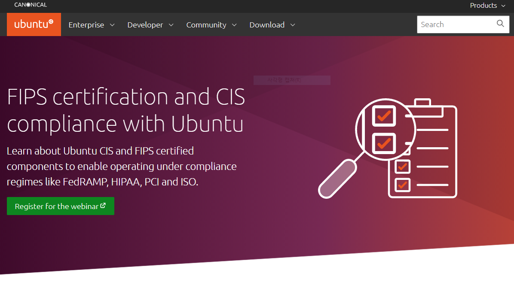
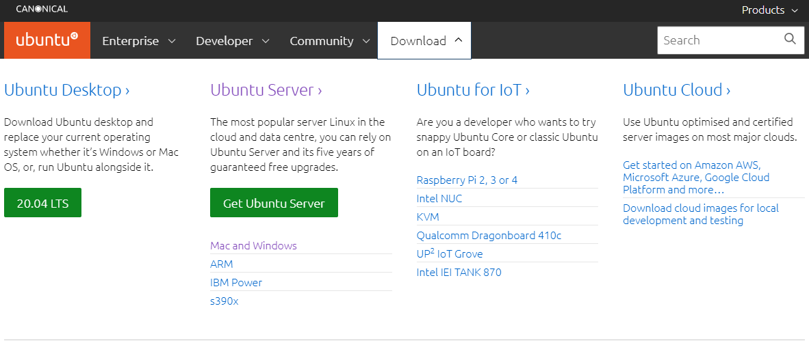
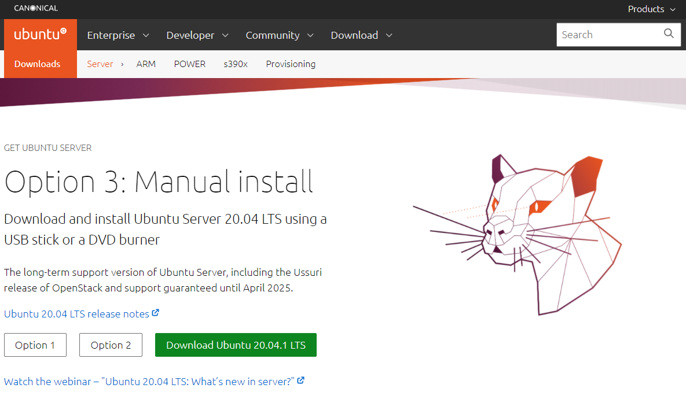
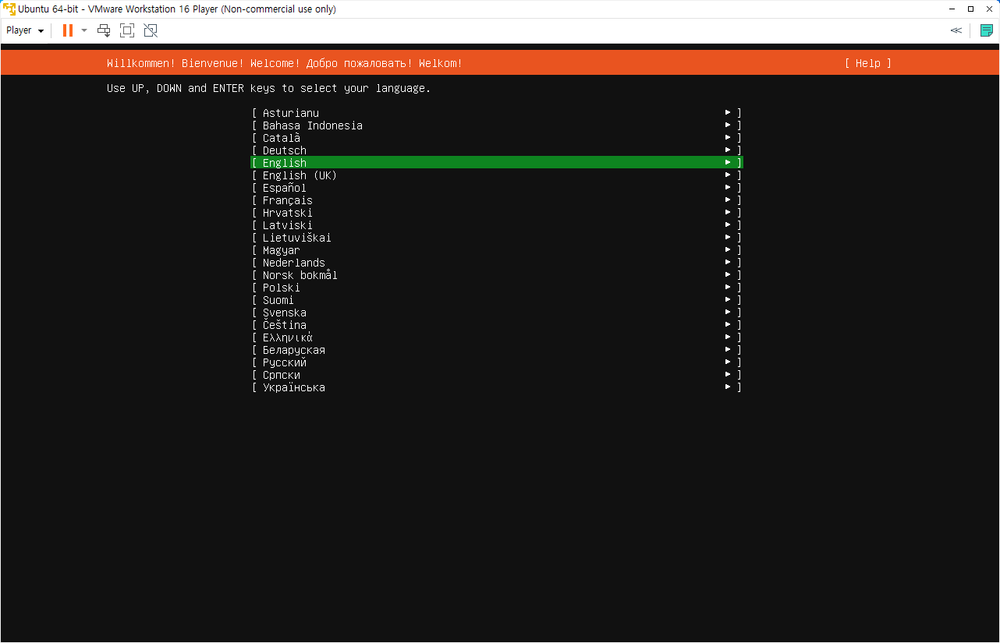
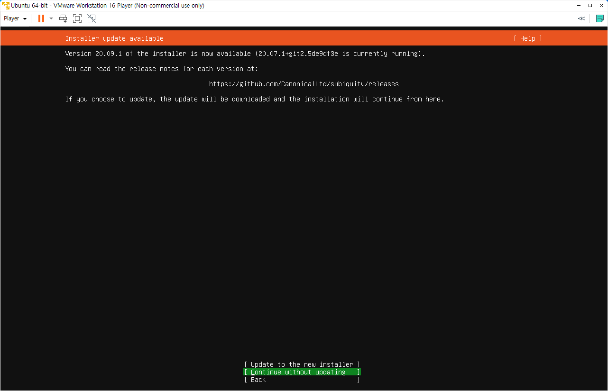
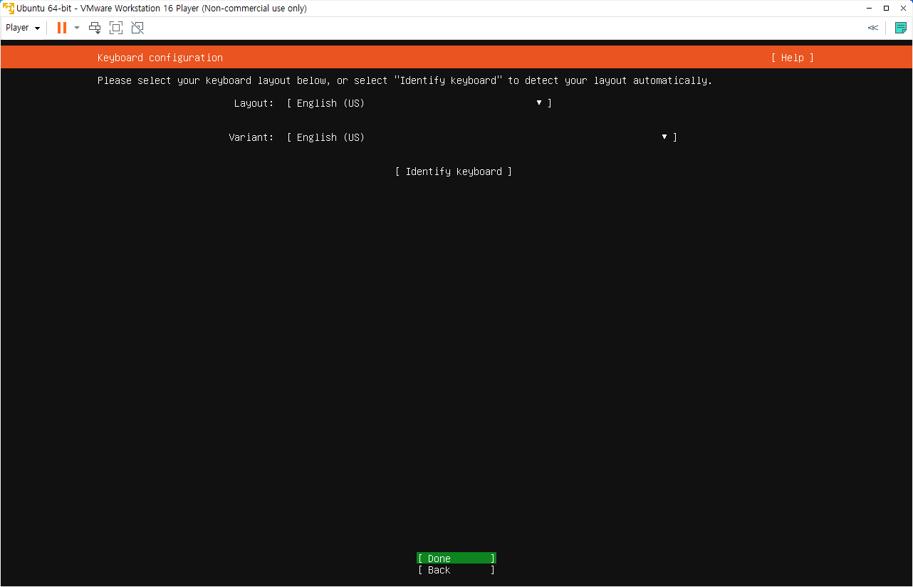

# Centos 리눅스 설치 Hands On 

## Centos 패키지 다운로드 

https://ubuntu.com/ -> Download -> Ubuntu Server -> Get Ubuntu Server -> Option 3: Manual install 
 
"Download Ubuntu 20.04.1 LTS" 클릭하여 다운로드

1. ubuntu 홈페이지 접속

2. Ubuntu Server 선택

3. Download Ubuntu 20.04.1 LTS 클릭하여 패키지 다운로드

 
---
## Ubuntu 설치

1. 이미지를 넣고 부팅하고 설치 화면에서 언어를 선택합니다.

2. 업데이트 방법을 선택합니다. : "Continue without Updating"

3. 키보드 레이아웃을 선택합니다.

4. 자동으로 설정된 Nat,Host Controller 네트워크 정보를 확인합니다.

5. Proxy 서버와 Update 서버를 설정합니다. Proxy 서버는 입력하지 않습니다.

6. Disk 파티션을 설정합니다. 기본값으로 진행합니다.

 
 

7. 관리 사용자를 추가하고 비밀번호 설정을 설정합니다.
 

8. SSH 접속을 위해 Openssh 를 설치합니다.
 

9. 패키지는 선택하지 않고 기본 패키지로만 설치하고 설치가 완료되면 리부팅합니다.
 
 
  
 

10. 설치가 완료되면 설정한 관리자 계정으로 접속합니다.
Ubuntu/Debian 은 관리자 계정으로 접속되며 sudo 를 사용하여 root권한을 사용합니다.
 
 
