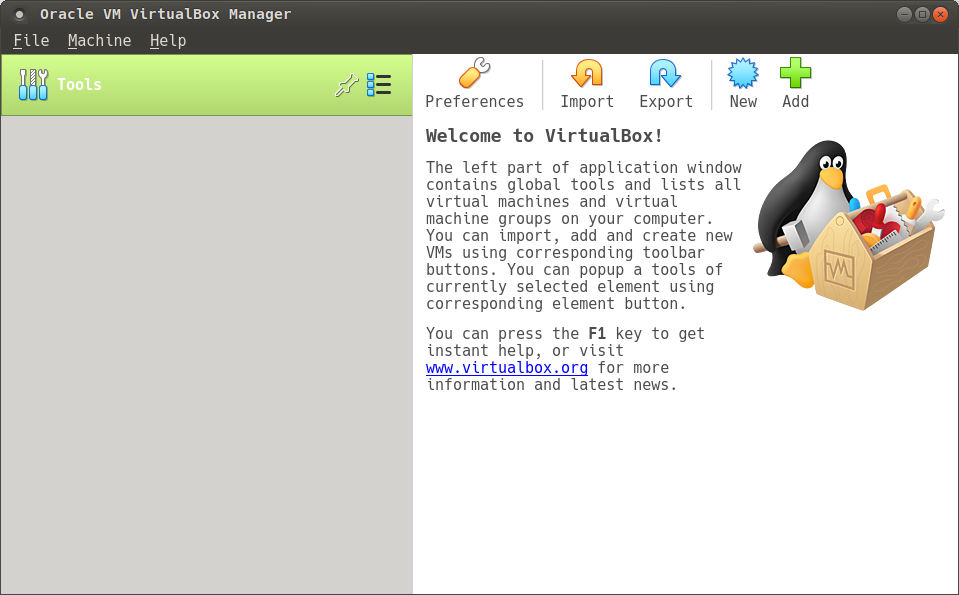
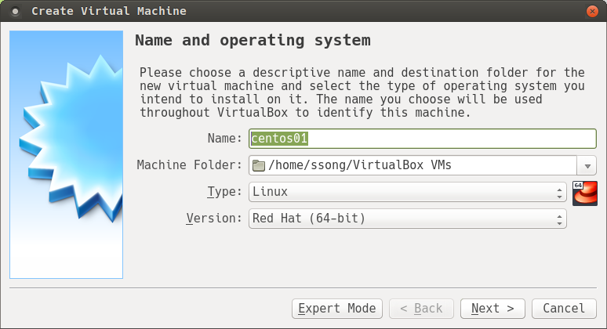
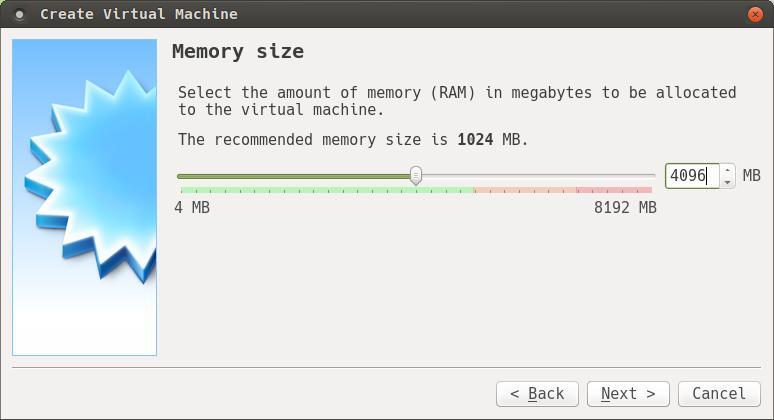
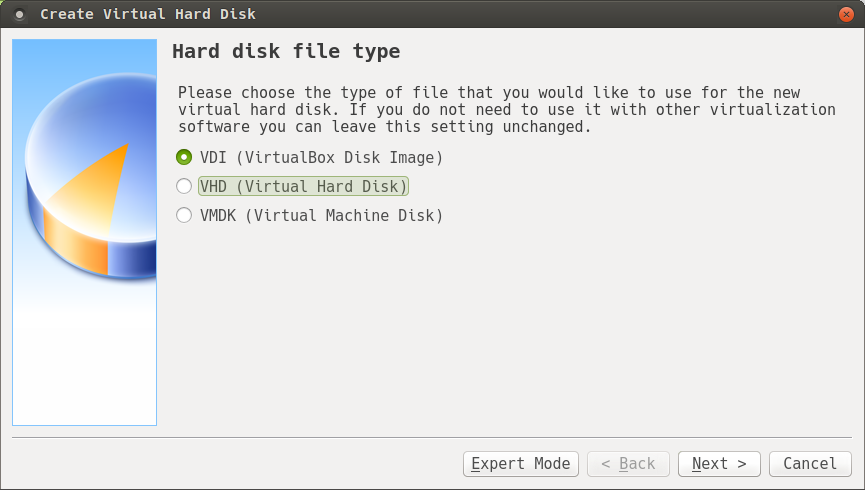
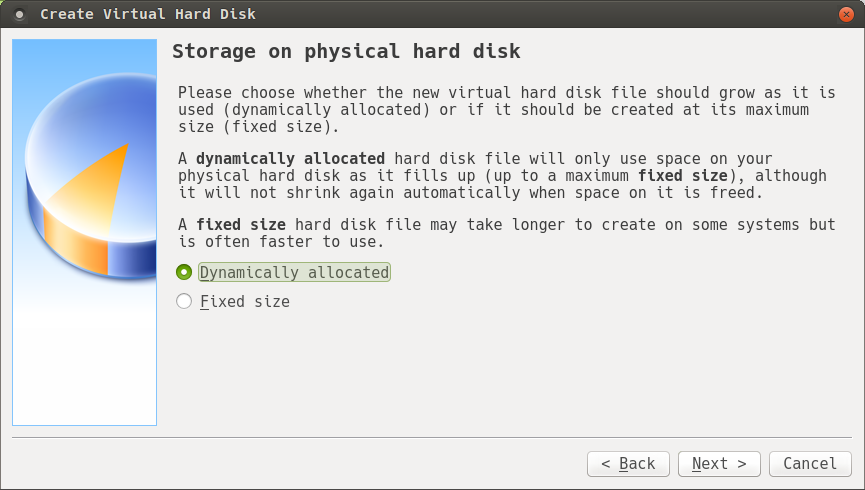
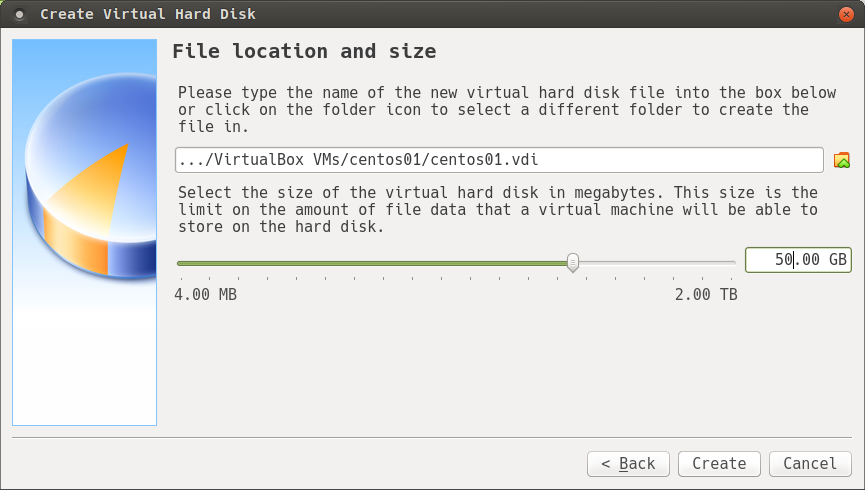
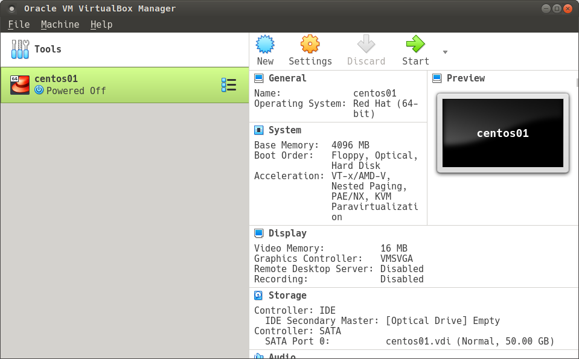
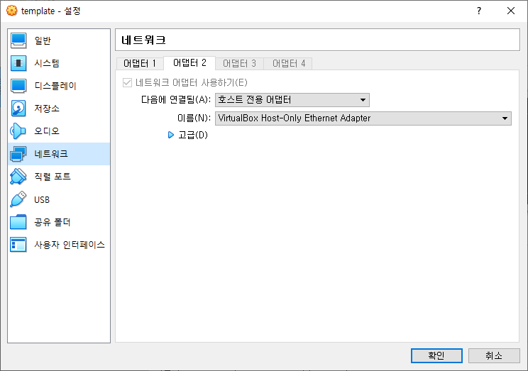

# Virtualbox 설정

## Virtualbox 다운로드
1. https://www.virtualbox.org/ 접속후 downloads 페이지로 이동합니다.


2. PC에 알맞은 버전의 virtualbox 를 선택하고 다운로드 합니다.


3. 다운로드받은 패키지로 virtualbox를 설치합니다.


---

## Virtualbox VM 생성
리눅스이미지 다운로드는 [centos](../centos/README.md)  또는 [debian](../debian/README.md) 를 참고하세요

1. Virtualbox 기동후 New 클릭으로 새로운 VM 생성

2. 필수정보 입력후 다음 - 이름(Name) : <아이디>01 , Type : Linux , Version : Red Hat (64-bit)

3. 메모리를 4096MB(4G) 로 설정합니다.

4. Hard disk 를 만들 방법을 정의합니다.

5. Hard disk 타입을 정의합니다. 본 Labs 에서는 VDI 로 생성합니다.

6. Hard disk 생성 방법을 선택합니다. dymamically allocation : 사용하면서 지속적으로 증가, Fixed size : 생성시 설정사이즈를 전부 할당

7. Hard disk 생성 위치와 크기를 설정합니다.

8. 최종 생성된 VM 을 확인하고 시작을 클릭하면 VM이 생성 됩니다. 최초 VM 생성시 다운로드받은 이미지를 선택하면 리눅스 설치화면을 확인할 수 있습니다.



## Virtualbox 네트워크 설정
PC(Host)에서 접속하수 있도록 네트워크 설정을 진행합니다.
설정 > 네트워크 > 어댑터 2 > 호스트 전용 어댑터


VM 콘솔로 접속하여 호스트 컨트롤 아이피 확인 후에 VM 으로 SSH로 접속할 수 있습니다.
아래 예제는 enp0s8 이 호스트 컨트롤러 입니다.
```
]# ip a
1: lo: <LOOPBACK,UP,LOWER_UP> mtu 65536 qdisc noqueue state UNKNOWN group default qlen 1000
    link/loopback 00:00:00:00:00:00 brd 00:00:00:00:00:00
    inet 127.0.0.1/8 scope host lo
       valid_lft forever preferred_lft forever
    inet6 ::1/128 scope host 
       valid_lft forever preferred_lft forever
2: enp0s3: <BROADCAST,MULTICAST,UP,LOWER_UP> mtu 1500 qdisc pfifo_fast state UP group default qlen 1000
    link/ether 08:00:27:10:0b:d3 brd ff:ff:ff:ff:ff:ff
    inet 10.0.2.15/24 brd 10.0.2.255 scope global noprefixroute dynamic enp0s3
       valid_lft 75533sec preferred_lft 75533sec
    inet6 fe80::a00:27ff:fe10:bd3/64 scope link 
       valid_lft forever preferred_lft forever
3: enp0s8: <BROADCAST,MULTICAST,UP,LOWER_UP> mtu 1500 qdisc pfifo_fast state UP group default qlen 1000
    link/ether 08:00:27:23:b0:ed brd ff:ff:ff:ff:ff:ff
    inet 192.168.0.3/24 brd 192.168.0.255 scope global noprefixroute dynamic enp0s8
       valid_lft 483sec preferred_lft 483sec
    inet6 fe80::a00:27ff:fe23:b0ed/64 scope link 
       valid_lft forever preferred_lft forever
```