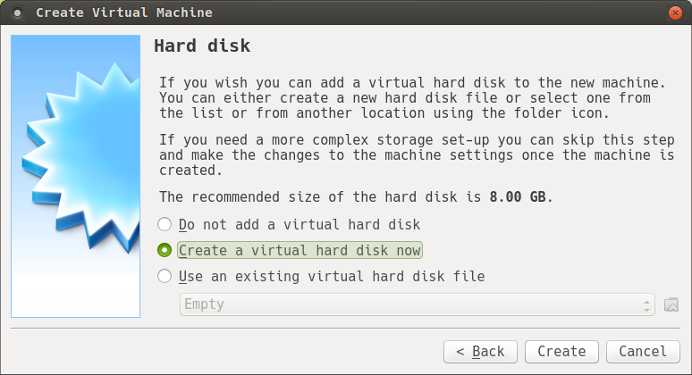

# Virtualbox 설정

## Virtualbox 다운로드
1. https://www.virtualbox.org/ 접속후 downloads 페이지로 이동합니다.

2. PC에 알맞은 버전의 virtualbox 를 선택하고 다운로드 합니다.

3. 다운로드받은 패키지로 virtualbox를 설치합니다.

---

## Virtualbox VM 생성
리눅스이미지 다운로드는 [centos](../centos/README.md)  또는 [debian](../debian/README.md) 를 참고하세요

1. Virtualbox 기동후 New 클릭으로 새로운 VM 생성

2. 필수정보 입력후 다음 - 이름(Name) : <아이디>01 , Type : Linux , Version : Red Hat (64-bit)

3. 메모리를 4096MB(4G) 로 설정합니다.

4. Hard disk 를 만들 방법을 정의합니다.

5. Hard disk 타입을 정의합니다. 본 Labs 에서는 VDI 로 생성합니다.

6. Hard disk 생성 방법을 선택합니다. dymamically allocation : 사용하면서 지속적으로 증가, Fixed size : 생성시 설정사이즈를 전부 할당

7. Hard disk 생성 위치와 크기를 설정합니다.

8. 최종 생성된 VM 을 확인하고 시작을 클릭하면 VM이 생성 됩니다. 최초 VM 생성시 다운로드받은 이미지를 선택하면 리눅스 설치화면을 확인할 수 있습니다.
