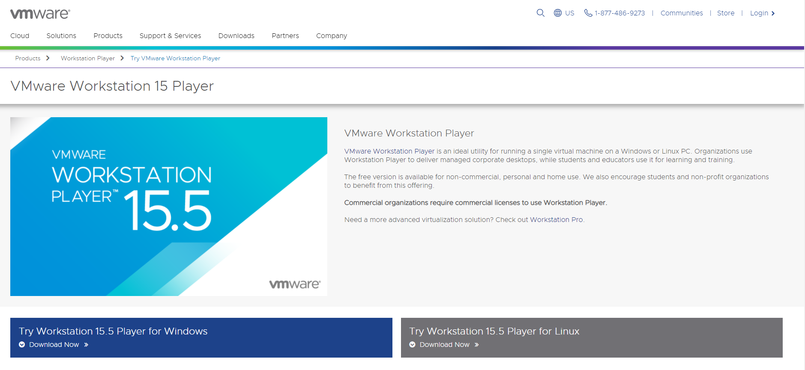

# VMware 설정

## VMware player 다운로드
1. https://www.vmware.com/products/workstation-player/workstation-player-evaluation.html 접속후 downloads 페이지로 이동합니다. 

2. PC에 알맞은 버전의 virtualbox 를 선택하고 다운로드 합니다.
 

--- 
## VMware VM 생성
리눅스이미지 다운로드는 [centos](../centos/README.md)  또는 [debian](../ubuntu/README.md) 를 참고하세요

1. VMware 기동후 Create a New Virtual Machine 클릭으로 새로운 VM 생성

2. 다운로드 받은 리눅스 이미지 선택합니다.
 

3. 리눅스에서 사용할 사용자 정보를 입력합니다.

4. VM 의 이름과 VM 이 저장될 위치를 지정합니다.

5. Hard disk 크기와 생성 방법 선택합니다. 

7. 설정된 VM의 정보를 확인합니다. 호스트 네트워크 설정을 위해 Customize Hardware 를 선택합니다.

8. 하단의 Add 버튼을 클릭하고 Network Adapter(Host-only)를 추가하고 완료합니다.

 
VM 콘솔로 접속하여 호스트 컨트롤 아이피 확인 후에 VM 으로 SSH로 접속할 수 있습니다.
아래 예제는 enp34 디바이스가 호스트 컨트롤러 입니다.
